# LAB1: Overview Of SageMaker Studio
 
# learning outcome from this lab
- Navigate Sagemaker studio and familiarise yourself with all the necessary functionalities for completing today's labs
- Making a Binary Prediction of Whether a Handwritten Digit is a 0

## 0. Prerequisite
- Make sure you have completed this pre-req [from the SageMaker immersion day workshop](https://sagemaker-immersionday.workshop.aws/prerequisites/option1.html ) 
- Read each cell description
- Launch one cell at a time.
- While waiting for the training, try and explore the Sagemaker console
## 1. Amazon SageMaker Studio UI Overview
- Explore the Left sidebar
- File and resource browser
- Main work area
- Settings

## 2. Simple Tasks to carry out
### 2.1 Upload a file
- Create a plain text file with your name on it and title it **"your_name.txt"**, content of the file should just be your email address.
- To upload files to your home directory
- In the left sidebar, choose the File Browser icon ( 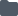 ).
- In the file browser, choose the Upload Files icon (  ).
- Select the files you want to upload and then choose Open.
- You should now have this directory structure (after completing pre-req step 0)
 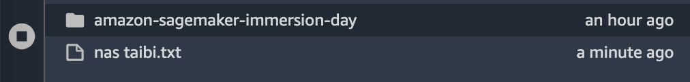
- Double-click a file to open the file in a new tab in Studio.
### 2.2 Clone a git repository
- In the left sidebar, choose the File Browser icon (  ).
- Choose the root folder or the folder you want to clone the repo into.
- In the left sidebar, choose the Git icon (  ).
- Choose Clone a Repository.
- Enter the URI for the SageMaker examples repo https://github.com/nataibi/sm-mnist-basic.git
- Choose CLONE.
- If the repo requires credentials, you are prompted to enter your username and password.
- Wait for the download to finish. After the repo has been cloned, the File Browser opens to display the cloned repo.
- Double click the repo to open it.
- Choose the Git icon to view the Git user interface which now tracks the examples repo.
- To track a different repo, open the repo in the file browser and then choose the Git icon.

## 3. Launch the MNIST example 
- From the pre-req step (0) and step 2.2 you should now see two directories on the left sidebar
 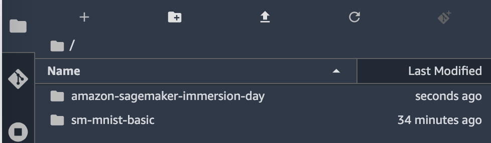
-  click on the **sm-mnist-basic** directory, and click on the **linear_learner_mnist.ipynb**, the notebook will launch in the main work area
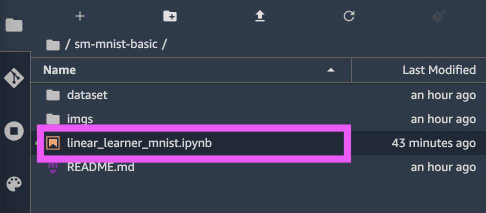
- You will now be prompted to select a kernel, choose **Python 3 (SageMaker JumpStart Data Science 1.0) **
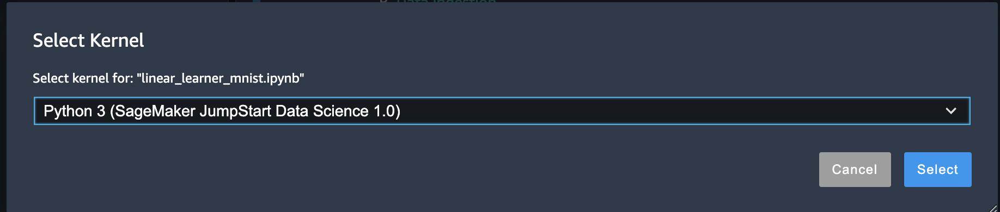
- The kernel will take couple of minutes to initialise
- Read the introduction to linear learner example
- TIPs on running notebook cells
 - - You can either use the tool bar "Play button" 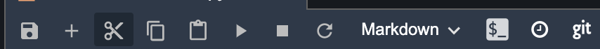
 - - Or use the keyboard shortcut SHIFT+ENTER
- Set permission and correct role
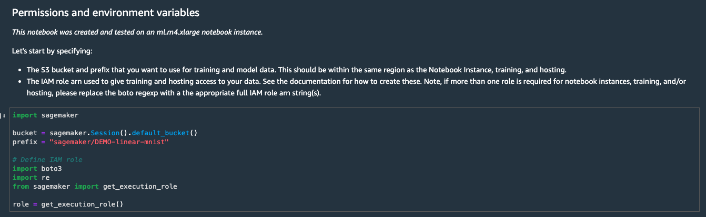
- Data ingestion phase, the dataset is already available in this report, as follows:
 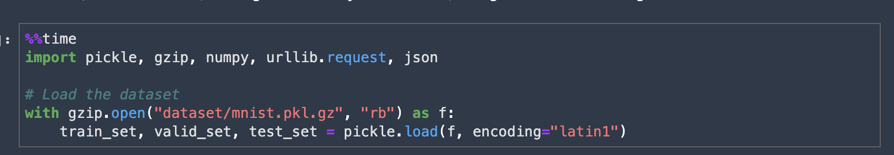
- Inspect the dataset
 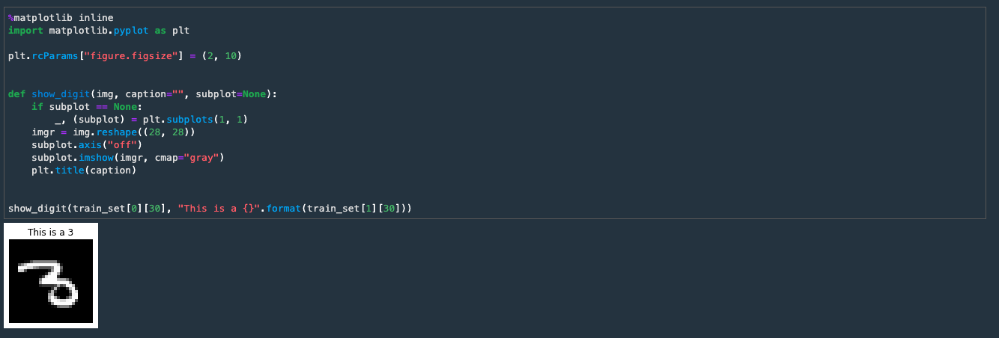
- Converting the dataset 
 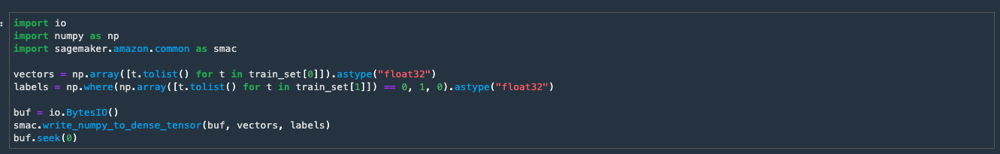
- Upload the training
  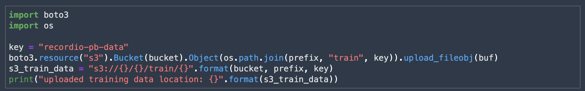
- Now we can start training the linear model. we start by specifying the container we'll be using.
- Then we kick off the base estimator. This step will take 6-8 mins, observe the outputs as it progresses.
 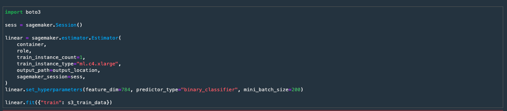
- Now you're model is read, we need to host it somewhere
 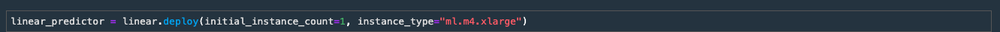
- Let's validate the model by predicting a single record
- First we need to set some request parameter
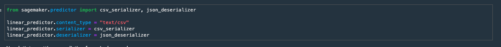
- Now let's send a prediction
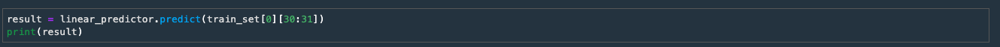
- Now that we verified this works, let's try and send an entire batch, observe the results
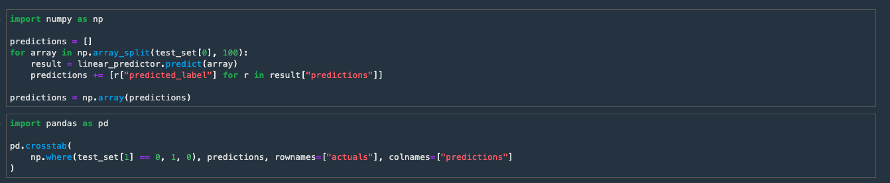
- Cleanup and Delete the endpoint
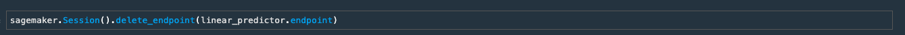

